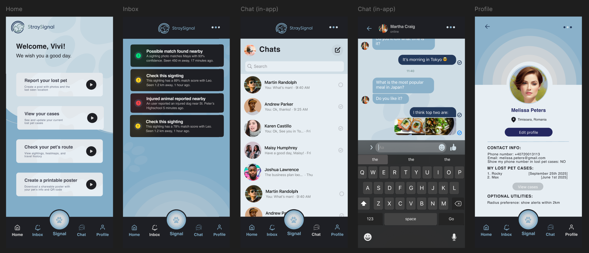
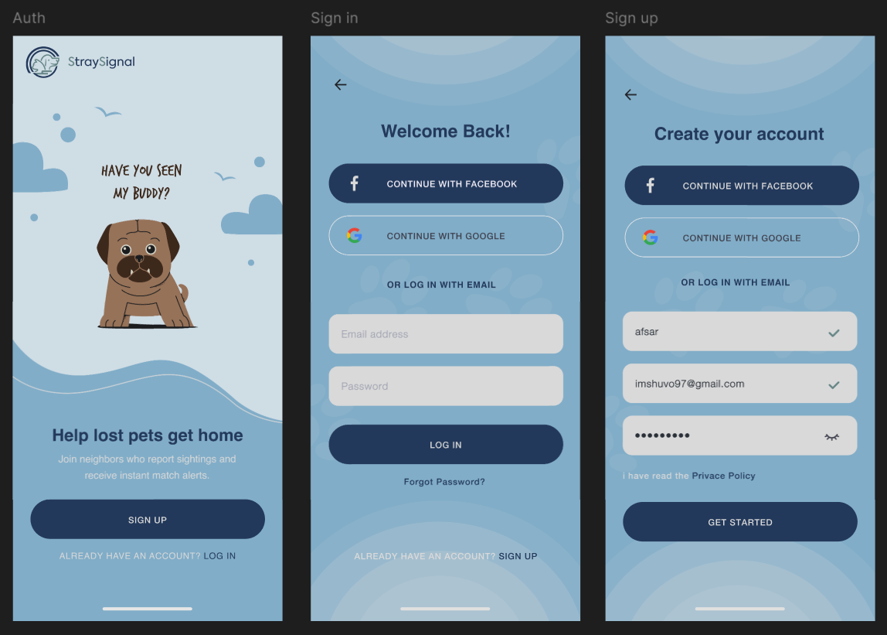
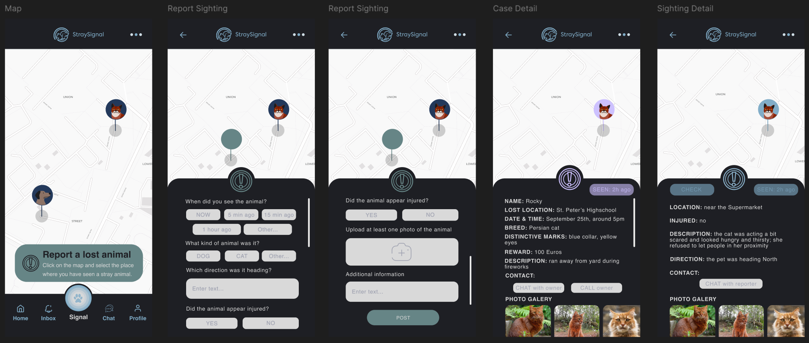

# StraySignal

A React Native mobile application for reuniting lost pets with their owners through AI-powered image matching and real-time alerts.

## 🎯 Overview

StraySignal helps pet owners and good Samaritans report lost pets and street sightings. The application uses machine learning to automatically match spotted animals with lost pet reports, providing location-based alerts to increase the chances of successful reunions.

## 🎨 UI Preview



### Auth Flow


### Map & Alerts


## 🛠️ Tech Stack

### Frontend
- **React Native** - Cross-platform mobile framework
- **Expo** - Development toolchain and runtime
- **TypeScript** - Type-safe JavaScript
- **Expo Router** - File-based navigation
- **React Native Maps** - Interactive map display
- **Clerk** - Authentication and user management
- **Socket.IO Client** - Real-time chat
- **AsyncStorage** - Local data persistence

### Backend
- **Node.js** - JavaScript runtime
- **Express** - Web application framework
- **MongoDB** - NoSQL database
- **Mongoose** - MongoDB object modeling
- **Socket.IO** - WebSocket server for real-time communication
- **TensorFlow.js** (@tensorflow/tfjs-node) - ML model execution
- **Sharp** - High-performance image processing
- **Multer** - File upload handling
- **CORS** - Cross-origin resource sharing
- **dotenv** - Environment variable management

### Machine Learning
- **ResNet50** (TensorFlow Hub) - Deep feature extraction (2048-d embeddings)
- **MobileNet V2** (fallback) - Lightweight CNN for image classification
- **Custom Color Histograms** - 8×8×8 RGB histogram analysis (512 bins)
- **Cosine Similarity** - Feature vector comparison
- **Histogram Intersection** - Color matching metric

## ✨ Features

- **Lost Pet Reporting**: Submit detailed reports with photos, location, and pet characteristics
- **Spotted Animal Reports**: Report animals seen on the streets with location and injury status
- **AI-Powered Matching**: MobileNet-based image recognition with color histogram analysis (50% visual, 40% color, 10% consistency)
- **Smart Alerts**: Real-time notifications for:
  - High confidence matches (≥95%) - Green alerts
  - Moderate confidence matches (80-94%) - Orange alerts
  - Injured animal sightings - Red alerts
- **Interactive Map**: View lost pets and sightings in your area with custom markers
- **Pet Route Tracking**: Visualize the path of your animals over time
- **In-App Chat**: Direct messaging between pet owners and reporters
- **Poster Generator**: Create printable lost pet posters
- **User Profiles**: Manage personal information and alert radius preferences

## 🏗️ Project Structure

```
StraySignal/
├── app/                          # React Native screens & navigation
│   ├── (tabs)/                   # Tab navigation screens
│   │   ├── home.tsx             # Home screen
│   │   ├── signal.tsx           # Map with reports
│   │   ├── chat.tsx             # Conversations list
│   │   ├── inbox.tsx            # Alert notifications
│   │   └── profile.tsx          # User profile
│   ├── auth/                    # Authentication screens
│   │   ├── sign-in.tsx
│   │   ├── sign-up.js
│   │   └── forgot-password.tsx
│   ├── chat/                    # Chat implementation
│   │   └── [id].tsx            # Individual conversation
│   ├── alert-details.tsx        # Alert details view
│   ├── report-lost-pet.tsx      # Lost pet form
│   ├── active-cases.tsx         # User's reports
│   ├── case-detail.tsx          # Report details
│   ├── pet-route.tsx            # Sighting path visualization
│   ├── poster-generator.tsx     # Lost pet poster creator
│   └── edit-profile.tsx         # Profile editor
├── server/                       # Node.js/Express backend
│   ├── server.js                # Main API server
│   ├── ml-service.js            # ML matching engine
│   ├── models/                  # MongoDB schemas
│   │   ├── User.js
│   │   ├── AnimalReport.js
│   │   ├── Match.js
│   │   ├── Conversation.js
│   │   └── Message.js
│   └── .env.example             # Environment variables template
├── contexts/                     # React Context providers
│   └── AlertContext.tsx         # Alert management
├── components/                   # Reusable UI components
│   ├── TopBar.tsx
│   ├── TopBarSecondary.tsx
│   └── BottomTabBar.tsx
├── constants/                    # App configuration
│   ├── api.ts                   # API endpoints
│   └── theme.ts                 # Color palette
├── assets/                       # Images, icons, backgrounds
├── utils/                        # Utility functions
└── lib/                          # External libraries integration
```

## 🚀 Getting Started

### Prerequisites

- **Node.js** (v18 or higher)
- **npm** or **yarn**
- **Expo CLI**: `npm install -g expo-cli`
- **MongoDB** (Atlas account or local instance)
- **Clerk** account for authentication
- **Android Studio** (for Android) or **Xcode** (for iOS)

### Installation

1. **Clone the repository**
```bash
git clone https://github.com/constantin-catalina/StraySignal.git
cd StraySignal
```

2. **Install dependencies**
```bash
npm install
```

3. **Configure environment variables**

Create `server/.env` file:
```env
PORT=3000
MONGODB_URI=mongodb+srv://<username>:<password>@<cluster>.mongodb.net/
MONGODB_DB_NAME=StraySignal
CLERK_PUBLISHABLE_KEY=pk_test_...
CLERK_SECRET_KEY=sk_test_...
```

Create `.env` file in root:
```env
EXPO_PUBLIC_API_URL=http://localhost:3000/api
EXPO_PUBLIC_CLERK_PUBLISHABLE_KEY=pk_test_...
```

4. **Start the backend server**
```bash
cd server
node server.js
```

5. **Start the Expo development server**
```bash
# In a new terminal, from project root
npx expo start --clear
```

6. **Run on device/emulator**
- Press `a` for Android emulator
- Press `i` for iOS simulator
- Scan QR code with Expo Go app for physical device

## Usage

### Reporting a Lost Pet
1. Navigate to **Home** → **Report Lost Pet**
2. Fill in pet details (name, type, breed, last seen location)
3. Add photos (supports multiple images)
4. Submit report - ML processing triggers automatically

### Reporting a Spotted Animal
1. Navigate to **Signal** tab (map view)
2. Tap **Report Sighting** button
3. Add photos and mark if injured
4. Submit - system checks for matches with lost pets

### Viewing Alerts
1. Check **Inbox** tab for notifications
2. Alerts color-coded by confidence:
   - 🟢 Green: ≥95% match confidence
   - 🟠 Orange: 80-94% match confidence
   - 🔴 Red: Injured animal reported
3. Tap alert to view details and contact reporter

## ML Matching System

### Architecture
- **Base Model**: MobileNet V2 (1280-dimensional embeddings)
- **Color Analysis**: 8×8×8 RGB histograms (512 bins)
- **Aggregation**: Mean embeddings with consistency scoring

### Scoring Formula
```
baseScore = (visual × 0.50) + (color × 0.40) + (consistency × 0.10)
finalScore = baseScore + metadataBonus
```

### Metadata Bonuses
- **Animal Type Match**: +2%
- **Temporal Proximity**:
  - ≤3 days: +6%
  - ≤7 days: +3%
  - >30 days: -8%

### Thresholds
- **Display Minimum**: 55%
- **Alert Creation**: 80%
- **Color Coding**: 80% (orange), 95% (green)

### API Endpoints

#### Reports
- `POST /api/reports` - Create spotted report
- `POST /api/reports/lost-pet` - Create lost pet report
- `GET /api/reports` - Get all reports
- `GET /api/reports/:id` - Get specific report
- `PUT /api/reports/:id` - Update report
- `DELETE /api/reports/:id` - Delete report

#### Matches
- `POST /api/matches/process/:reportId` - Process spotted report for matches
- `POST /api/matches/reprocess-all` - Reprocess all reports
- `GET /api/matches/user/:userId` - Get user's matches
- `PUT /api/matches/:matchId/check` - Mark match as checked

#### Users
- `POST /api/users` - Create/update user profile
- `GET /api/users/:clerkId` - Get user by Clerk ID

#### Chat
- `POST /api/conversations` - Create conversation
- `GET /api/conversations/user/:userId` - Get user conversations
- `POST /api/messages` - Send message
- `GET /api/messages/conversation/:conversationId` - Get messages
- `DELETE /api/messages/:messageId` - Delete message

## ⚠️ Limitations

### Technical Limitations
1. **ML Accuracy**: MobileNet can confuse similar-looking animals
   - Same species with similar coloring may score high
   - Works best with distinctive markings or unique colors
   - Color histograms help but not foolproof

2. **Image Quality Dependency**: 
   - Low-light photos reduce accuracy
   - Blurry images affect embedding quality
   - Multiple angles recommended for best results

3. **Performance**:
   - ML processing takes 2-5 seconds per report
   - Reprocessing all reports can be slow with large datasets
   - Image uploads limited to 50MB per request

4. **Scalability**:
   - Single-server architecture
   - No CDN for image storage
   - MongoDB queries not optimized for millions of reports

### Functional Limitations
1. **Location-Based**:
   - Requires GPS permissions
   - No offline mode for map features
   - Distance calculations approximate (Haversine formula)

2. **Real-Time Updates**:
   - Socket.IO used only for chat
   - Map markers require manual refresh
   - Alert polling every 5 minutes

3. **User Experience**:
   - No push notifications (only in-app alerts)
   - Limited to 10 photos per report
   - No video support

4. **Authentication**:
   - Requires Clerk subscription
   - No guest/anonymous reporting
   - Email verification required

## 🔧 Configuration

### Adjust ML Weights
Edit `server/ml-service.js`:
```javascript
config = {
  weights: {
    visual: 0.50,      // Feature embedding similarity
    color: 0.40,       // Color histogram match
    consistency: 0.10  // Multi-photo consistency
  },
  metadataWeights: {
    animalTypeMatch: 0.02,
    temporal: {
      recent: 0.06,
      week: 0.03,
      old: -0.08
    }
  }
}
```

### Change Alert Thresholds
Edit `contexts/AlertContext.tsx`:
```typescript
// Line 127: Minimum score to create alert
if (match.matchScore < 80) continue;

// Line 157: Color coding thresholds
type: match.matchScore >= 95 ? 'high-match' : 'moderate-match'
```

### Modify Alert Radius
Default: 2km (adjustable in user profile settings)

### Reprocess All Matches
```bash
curl -X POST http://localhost:3000/api/matches/reprocess-all
```

or

```bash
Invoke-RestMethod -Uri "http://localhost:3000/api/matches/reprocess-all" -Method Post
```

## License

This project is licensed under the MIT License.
